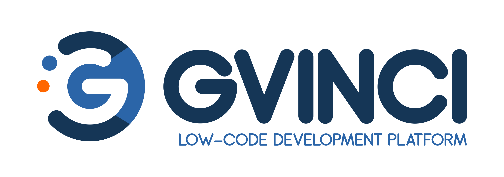

# Introdução

O Gvinci é uma Plataforma Low-Code que agiliza e facilita o desenvolvimento de Sistemas e Apps.

Crie sistemas, websites e lojas online com esta ferramenta que vai revolucionar a sua forma de trabalhar;

Opções para folhas de pagamento, sistemas de CRM, Gestão de estoque e sites com administração de conteúdo;

Suporte nativo a vários bancos de dados;

Integração com PayPal® para sua loja virtual;

Opções de design com controles Telerik®;

Na mesma solução gere Web, DeskTop e Web App Mob;

## Porque Usar?

O Gvinci permite a entrega rápida de aplicativos de negócios com investimento inicial mínimo em configuração, treinamento e implantação:

* Inovar mais rápido e trabalhar com mais inteligência;
* Melhorar a experiência do cliente;
* Melhorar a eficiência operacional;
* Economizar recursos e aumentar faturamento;

