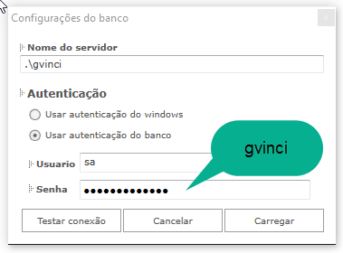

# Baixando e instalando o GVinci

## Instalando o Gvinci

Durante a instalação do **Gvinci**, o SQL Server também poderá ser instalado.

É importante lembrar que, para o sucesso da instalação, todos os requisitos descritos no tópico [Requisitos do sistema](http://www.gvinci.com.br/manual/plataforma_necessaria.htm) devem ser satisfeitos. Para instalar o **Gvinci**, siga as instruções a seguir:

### **1.** Em seu navegador, acesse o link: [http://www.gvinci.com.br/Site/Home](http://www.gvinci.com.br/Site/Home)

### **2.** A página abaixo é exibida. Clique no botão ;

Aparecerão as opções:

### **3.** Escolhendo a segunda opção, preencha os dados solicitados:

### **4.** Após o preenchimento dos dados e clicar no botão **"Continuar"**, teremos a confirmação da criação da conta SSI e a ativação da licença de testes por 30 dias, no quadro abaixo disponibiliza a última versão para baixarmos e iniciar a instalação.

Você receberá um e-mail com instruções. Abra sua caixa de entrada para ler as instruções enviadas.

### **5.** Ainda na tela de confirmação do cadastro, clique no botão **"Baixar"**

### **6.** Após o download, localize o arquivo instalador e execute-o, através de um duplo clique. Um aviso de segurança será exibido.

### **7.** Clique em **"Executar"** e escolha o idioma da instalação:

### **8.** Nesta tela temos a apresentação do Assistente de Instalação, clique em **"Avançar"**

### **9.** Escolha do destino da instalação, o padrão é oferecido, mas pode ser alterado neste momento clicando em **"Procurar"** ou digitando o caminho. Seguimos clicando em **"Avancar"**

### **10.** Agora escolheremos o tipo de instalação, tendo a **"Completa"** como padrão:

Podendo escolher a **"Personalizada"**:

### **11.** Escolheremos a **"Completa"**, mas observem que as opções **"Gvinci"** e **".NET Framework"** serão sempre instaladas, podendo desmarcar apenas a opção "SQL Server Express"

### **12.** Mantendo todas as opções marcadas, avançamos para a tela de definição da pasta do menu para os atalhos:

### **13.** Definição de atalhos:

### **14.** Temos então a tela de confirmação da instalação, apresentando as definições escolhidas, clique em **"Instalar"**

### **15.** Como deixamos selecionado para instalar o SQL Server e o LocalDB, solicita sua confirmação para efetuar o downloads, clique em **"Sim"**

Após confirmar o download, aparecerá a tela demonstrando o progresso, lembrando que o tempo de conclusão dependerá da sua conexão com a internet.

### **16.** Ao concluir o download a instalação do SQL iniciará e, dependendo da configuração do equipamento, poderá demorar apresentando esta tela:

### **17.** Será solicitado para reiniciar o computador, escolha **"Sim"** e clique em **"Concluir"**

Após a conclusão dessas instruções, o **Gvinci** estará pronto para ser acessado.

## Configuração do Banco de Dados

Quando for utilizar o **Gvinci** pela primeira vez, você não precisa definir as configurações de banco de dados da ferramenta.

Os parâmetros de configuração já foram inseridos quando ocorreu a instalação do **Gvinci**, que inclui a instalação e configuração do SQL Server 2012 Express.

O SQL Server é usado pelo **Gvinci** para armazenar as definições dos projetos, ou seja, para exibir toda a estrutura criada nas definições de bancos, tabelas e campos no **Gvinci**. Os dados preenchidos na tela exibida abaixo devem corresponder aos mesmos dados cadastrados no SQL Server. Para testar a conexão ao banco de dados e consultar seus dados, você poderá utilizar-se do SQL Server Management Studio, que permite acessar toda a estrutura do servidor com seus bancos e tabelas, exibindo todas as suas propriedades.

A tela **"Configurações do banco"** é exibida em duas situações:

**1.** Após clicar na opção "Reconfigurar servidor", na tela de Login do **Gvinci**:

**2.** Após clicar no botão **"Configurar banco"**, no painel Banco de dados do **Gvinci:**

            Em ambos os casos teremos esta tela, então preencha os campos necessários conforme as explicações a seguir:

**Nome do servidor:** Neste campo você deve inserir o nome do servidor de banco de dados. Você pode usar por exemplo o seguinte servidor:

                             **• .\gvinci**

O ponto \( **.** \) significa servidor local \(da própria máquina\) e **gvinci** é a instância padrão criada na instalação do SQL Server.

Qualquer outro servidor SQL Server 2008 ou um servidor SQL mais recente pode ser utilizado.

**Autenticação:** Define o tipo de autenticação com o banco:

                                   • Usar autenticação do Windows \(Trusted Connection = True\).                                   • Usar autenticação do banco \(Trusted Connection = False\).

         Ao marcar esta opção, será necessário inserir o nome do usuário e a senha que foram cadastrados durante a instalação do SQL Server.                                                  **• Usuário:** Insira aqui o nome de usuário cadastrado no servidor de banco de dados.                                                  O usuário padrão de administrador do SQL Server é "sa" \(System Administrator\).

                                                  **• Senha:** A senha padrão já cadastrada durante a instalação e configuração do SQL Server 2012 Express, que ocorreu durante a instalação do **Gvinci**, é **"gvinci"**

Use o botão  para testar a conexão antes de abrir o banco de dados. Caso a conexão seja efetivada, a mensagem abaixo será exibida:

Com o sucesso da conexão, clique no botão .

Após preencher os dados, clique em .

Na primeira conexão com o servidor, o **Gvinci** irá criar um banco de dados chamado **GvinciSys**. Para se certificar disso, abra o Management Studio, do Microsoft SQL Express. Observe a figura abaixo:

A cada nova solução criada, um novo banco de dados é criado, abaixo do banco GvinciSys. Na figura acima, a primeira solução criada resultou na criação do banco GvinciUser\_68, pois o nome não foi definido no **Gvinci**.

## Requisitos de Sistema

Para executar o Gvinci é necessária a seguinte plataforma:

<table>
  <thead>
    <tr>
      <th style="text-align:left">Arquiteturas suportadas</th>
      <th style="text-align:left">x86; x64</th>
    </tr>
  </thead>
  <tbody>
    <tr>
      <td style="text-align:left">Sistemas operacionais suportados</td>
      <td style="text-align:left">Windows Server 2003 ou superior;Windows 8; Windows 8.1; Windows 10 ou
        Superior.</td>
    </tr>
    <tr>
      <td style="text-align:left">Software para executar o GVinci</td>
      <td style="text-align:left">
        
.NET Framework 4.0 com Service Pack 1 ou superior - conjunto de bibliotecas
          que oferece v&#xE1;rias fun&#xE7;&#xF5;es e recursos prontos como ferramentas,
          compondo a plataforma necess&#xE1;ria para execu&#xE7;&#xE3;o de aplica&#xE7;&#xF5;es
          Web

        
MS SQL Server Express 2008 ou superior - para configurar e gerenciar os
          bancos de dados

        
MS SQL LocalDB 2014 - para possibilitar a utiliza&#xE7;&#xE3;o pelas aplica&#xE7;&#xF5;es
          geradas, caso deseje o desenvolvedor

        
NOTA: O instalador do Gvinci verifica a m&#xE1;quina e providencia as
          instala&#xE7;&#xF5;es dos pacotes necess&#xE1;rios para sua execu&#xE7;&#xE3;o
          (<a href="http://www.gvinci.com.br/manual/baixando_e_instalando_sql_server_2012_express.htm">t&#xF3;pico sobre instala&#xE7;&#xE3;o</a>)

      </td>
    </tr>
    <tr>
      <td style="text-align:left">Software para auxiliar o GVinci</td>
      <td style="text-align:left">&#x2022; Visual Studio 2015 ou superior - Link para baixar: <a href="https://www.visualstudio.com/pt-br/products/visual-studio-community-vs">Vers&#xE3;o Community</a>
      </td>
    </tr>
    <tr>
      <td style="text-align:left">Softwares para executar a aplica&#xE7;&#xE3;o gerada</td>
      <td style="text-align:left">
        <ul>
          <li>Servidor Windows IIS (recurso do pr&#xF3;rpio windows) - Videos</li>
          <li>.NET Framework 3.5 com Service Pack 1 ou superior - Link</li>
          <li>Opcionais da solu&#xE7;&#xE3;o, conforme defini&#xE7;&#xE3;o do desenvoledor:</li>
          <li>Bancos de dados com conex&#xE3;o nativa do Gvinci:</li>
          <li>MS SQL Server: Express 2008 ou superior - Link</li>
          <li>MySQL: 5.1 ou superior - Link</li>
          <li>Oracle: 9.1 ou superior - Link</li>
          <li>LocalDB: 2014 ou superior - Video</li>
          <li>PostgreSql: 9 ou superior - Link</li>
        </ul>
      </td>
    </tr>
    <tr>
      <td style="text-align:left">Report Viewer</td>
      <td style="text-align:left">
        <ul>
          <li>ReportViewer 2008 - Vers&#xE3;o 9 - Link</li>
          <li>ReportViewer 2010 - Vers&#xE3;o 10 - Link</li>
          <li>ReportViewer 2012 - Vers&#xE3;o 11 - Link</li>
        </ul>
      </td>
    </tr>
    <tr>
      <td style="text-align:left">Hardware</td>
      <td style="text-align:left">
        <ul>
          <li>Minimo: 2.2 GHz ou superior, 2048 MB RAM ou superior, 1280x1024 display,
            7200 RPM ou superior, Placa de v&#xED;deo com 256 Mb de mem&#xF3;ria, at&#xE9;
            550 Mb de espa&#xE7;o em disco (o espa&#xE7;o requerido depende da vers&#xE3;o
            do sistema operacional e suas atualiza&#xE7;&#xF5;es.</li>
        </ul>
      </td>
    </tr>
  </tbody>
</table>

